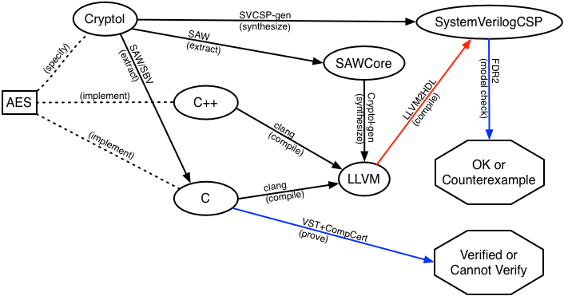

# AES by Galois

This repository contains artifacts that demonstrate Galois's tooling
capabilities for high assurance cryptography.  We also summarize some
of the enhancements we would like to create if a client is interested
in funding that development.

## Overview

We focus on synthesis from verified formal specifications written in
[Cryptol](http://www.cryptol.net) to and high assurance, high
performance implementations written in C, LLVM and
[SystemVerilogCSP](http://async.usc.edu/index.php/research/current/9-systemverilogcsp)
via [SAW](http://saw.galois.com)Core as of June 2016.

The figure above is an overview of all the artifacts and tooling
involved in the process.  The left-most box in the figure is the
single example used for this demonstration, that of AES.  All examples
are formally specified in Cryptol, which is then used for determining
correctness of both hand-coded and synthesized implementations in C,
C++, and LLVM. Each solid arrow denotes the tool used in the process
to produce the destination artifact.

The *SAW tool* can check implementations in LLVM, which can be
compiled from C or C++, against their Cryptol specification for
behavioral equivalence (i.e., the code computes the same outputs,
including side-effects, for the same given inputs as specified in
Cryptol; no more and no less).  On the other hand, *Cryptol-gen* can
generate LLVM from Cryptol specifications (via SAWCore) that is
guaranteed to behave as specified.  Moreover, the *SAW synthesis tool*,
which uses SAW+[SBV](http://leventerkok.github.io/sbv/), can extract a
C implementation from a Cryptol specification, and *SVCSP-gen* can
generate SystemVerilogCSP from Cryptol.

One additional capability Galois is interested in creating is a tool
that generates SystemVerilog/SystemVerilogCSP from LLVM.  This tool
does not currently exists and holds an interest for us and others in
part because of the conceptual disconnect between what the industry
that uses HDL is used to versus what we can provide today.  In
particular, Cryptol specifications are "stateless", akin to a pure
functional programming language, while many developers are more
familiar with "stateful" imperative languages.  Consequently, hardware
engineers often find learning and using Cryptol odd.

Note that our capability to synthesize HDL is now over a decade old.
Cryptol version one featured VHDL synthesis over a decade ago. Much of
that work was deployed on a variety of FPGAs. A non-public version of
current version of Cryptol version two supports synthesis to System
Verilog and SystemVerilogCSP. We have simulated the resulting HDL as
well as fabricated a test ASIC in 2016.

## AES

To demonstrate Galois's current capabilities, we use as a first
example the AES block cipher.  Below we describe the artifacts
produced in the process described above.

The AES block cipher is described in
[FIPS 197](http://csrc.nist.gov/publications/fips/fips197/fips-197.pdf). This
example is an instantiation of AES encryption with 128-bit keys; it
takes a key and a plaintext as parameters and produces a ciphertext
block. The following artifacts are included.

* [aes.cry](aes/aes.cry), a Cryptol specification of AES encryption
  suitable for conversion to SystemVerilogCSP.
* [aes.c](aes/aes.c), a C implementation of AES synthesized from
  Haskell ([AES.hs](aes/AES.hs)) by SBV; the Haskell code is an
  example included with SBV.
* [aes.ll](aes/aes.ll) and [aes.bc](aes/aes.bc), LLVM assembly and
  bitcode implementations (respectively) of AES generated from the C
  implementation.
* [aes.saw](aes/aes.saw), a SAWScript file that carries out an
  equivalence proof between the Cryptol specification and the C
  implementation.
* [aes.config](aes/aes.config), a configuration file for SVCSP-gen
  (not included here or in the Cryptol public release) that generates
  SystemVerilogCSP from the Cryptol source.
* [aes.gen](aes/aes.gen), a configuration file for Cryptol-gen that
  generates LLVM from the Cryptol source.
* [aes.c](aes/aes.c), a C implementation of AES synthesized from
  Haskell ([AES.hs](aes/AES.hs)) by SBV; the Haskell code is an
  example included with SBV.

* [AESTBox.cry](aes/AESTBox.cry), a Cryptol specification of AES
  encryption and decryption using TBoxes, translated from the
  aforementioned Haskell implementation.
* [AESTBox.gen](aes/AESTBox.gen), a configuration file for Cryptol-gen
  that generates LLVM from the TBox-based Cryptol source.

* [AES.cry] literate version of AES

* [Makefile](aes/Makefile), a Makefile to generate all the artifacts;
  note that this will not work without our tools installed.

The [gen](aes/gen) directory contains the following additional
generated artifacts.

* [aes-llvm](aes/gen/aes-llvm), LLVM code generated from the Cryptol
  source, along with a test harness, a SAWScript to prove its
  equivalence to the Cryptol source, and a Makefile that runs the
  equivalence proof and tests.
* [aes-svcsp](aes/gen/aes-svcsp), SystemVerilogCSP code generated from
  the Cryptol source, along with a test harness.

The generated designs consist of 302 functions, 1 non-test module, and
1 test module with a total of 2536 non-test LoC.

The [vivado](aes/vivado) directory contains Xilinx Vivado project
files for simulating and testing the generated SystemVerilogCSP.

## Other Examples

We have many other examples of similar verifications, synthesis
experiements, and more, much of which focuses on high assurance
cyrptography, but at times ranges further afield. After all, Cryptol
permits one to specify and reason about arbitrary computation at the
bit level, not just cryptographic algorithms. 

If there are other examples that you would find particularly
compelling, get in touch.

